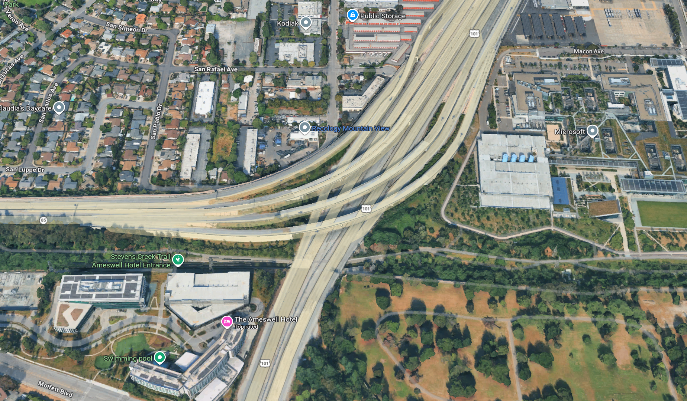

# SkyAugment — Aerial Edge-Case Generator

> **Photorealistic drone footage variants from simulation data — powered by Seedance 2.0 + Z.AI**

Built at the **Beta Super Hackathon** · May 2, 2026 · Computer History Museum · Track 4: Physical AI + Simulation

---

## The Problem

Drone perception teams are blocked on training data diversity. Real flight hours cost **$200–$2,000/hr**, and rare conditions — dust storms, dense fog, wildfire smoke — are expensive or dangerous to capture. ArduPilot SITL + Gazebo gives free synthetic trajectories, but the renders look like a video game. Models trained on them don't generalize to real-world sensor characteristics.

## The Solution

Drop a simulation frame. Type a scenario. Get **N labeled photorealistic variants** in 60 seconds.

```
Gazebo sim frame  ──►  Z.AI Scenario Reasoner  ──►  Seedance 2.0 Reference-to-Video  ──►  Labeled footage
```

**Real flight data:** ~$500/hr  
**SkyAugment:** ~$0.50/clip

---

## Demo

### Input: ArduPilot/Gazebo sim frame



### Prompt: *"dust storm at low sun angle over desert highway"*

> *Aerial drone footage, dust storm at low sun angle over desert highway. Slow gentle drone orbit at constant altitude, smooth circular pan, camera locked toward scene center. Real-time speed, continuous uncut shot.*

Generated variants include structured scenario metadata automatically expanded by Z.AI:

| Parameter | Value |
|---|---|
| **Lighting** | Harsh backlight from low sun angle, 18% particulate haze, warm orange tones |
| **Weather** | Dust storm with 40 mph sustained winds, horizontal visibility 150 m |
| **Terrain** | Arid desert highway, sand dunes flanking both sides, rocky outcrops |
| **Time of day** | Golden hour, ~18:00 local, sun at 10° elevation |
| **Atmospheric effects** | PM10 dust veil at 0–300 m AGL, airborne sand particles |
| **Camera artifacts** | Lens flare from sun angle, slight overexposure on horizon |

---

## How It Works

```
┌──────────────────┐     ┌─────────────────────────┐     ┌──────────────────────────┐
│  Gazebo / SITL   │     │   Z.AI Scenario Agent    │     │   Seedance 2.0           │
│  sim frame (PNG) │────►│   Short prompt → JSON    │────►│   Reference-to-Video     │
│                  │     │   lighting, weather,     │     │   image + structured     │
│  ArduPilot SITL  │     │   terrain, atmo effects, │     │   prompt → 5s 720p clip  │
│  ground truth    │     │   camera artifacts       │     │                          │
└──────────────────┘     └─────────────────────────┘     └──────────────────────────┘
                                                                      │
                                                          ┌───────────▼──────────────┐
                                                          │   Labeled variant set    │
                                                          │   cached locally,        │
                                                          │   served instantly       │
                                                          └──────────────────────────┘
```

The **Z.AI Scenario Reasoner** is the agentic layer — it takes a vague edge-case description and expands it into a precise, structured environmental spec that Seedance can condition on. This is not a UI wrapper; the agent reasons over lighting physics, atmospheric optics, and sensor characteristics to produce diversity-maximizing variants.

---

## Quickstart

```bash
git clone <repo>
cd betaFundHackathon
python -m venv .venv && source .venv/bin/activate
pip install -r requirements.txt
cp .env.example .env   # add your API keys
uvicorn backend.main:app --port 8000
# open http://localhost:8000
```

### Environment variables

```bash
SEEDANCE_API_KEYS=key1,key2,key3   # BytePlus Ark — round-robined
ZAI_API_KEY=your_zai_key           # Z.AI (Anthropic-compatible endpoint)
USE_CACHE=true                     # serve pre-generated results instantly
```

---

## Tech Stack

| Layer | Tech |
|---|---|
| Video generation | Seedance 2.0 (`dreamina-seedance-2-0-fast-260128`) via BytePlus Ark |
| Scenario reasoning | Z.AI GLM-4 via Anthropic-compatible API |
| Backend | FastAPI + async httpx polling |
| Frontend | Vanilla HTML/CSS/JS — no build step |
| Cache | JSON + local MP4 with ffmpeg faststart |

---

## Use Cases

- **Drone perception training data** — generate rare atmospheric conditions at scale
- **Autonomous vehicle sensor simulation** — photorealistic camera artifacts for model robustness
- **Defense/ISR** — edge-case augmentation for target detection under degraded visibility
- **ArduPilot community** — plug-and-play with existing SITL workflows

**Named buyers:** Anduril, Shield AI, Skydio, Zipline, Percepto, DoD test ranges

---

## Roadmap

| Timeline | Milestone |
|---|---|
| Day 1–2 | Cold-email 10 drone perception leads |
| Day 3–4 | Open-source ArduPilot integration plugin → r/ArduPilot, ArduPilot Discord |
| Day 5 | Apply to Beta University Cohort 11 |
| Day 6–7 | Publish AerialEdgeCase-100 dataset on HuggingFace |
| Month 1 | First design partner ($5K/mo, 1000 clips/mo) |
| Q1 | Integrate with Mirage cyber-range as perception-data module |

---

## Built By

**Pranav Bhusari** — Security + ML Engineer  
Ex-Cromulence / Parsons (DARPA/NSA-adjacent CNO) · MS Purdue CERIAS · Ex-LLNL / Peraton / Alif  
Operating: **Purdue Analytics LLC** (Mirage cyber range · Dragnet ICS honeypot · Kaiju RE+LLM tooling)

Direct experience with synthetic data pipelines, sim environments, and the defense/dual-use buyer.

🔗 [linkedin.com/in/pranav-bhusari](https://www.linkedin.com/in/pranav-bhusari)

---

*Submitted to Beta Super Hackathon · Track 4: Physical AI + Simulation · Submission code: butterbase0502*
